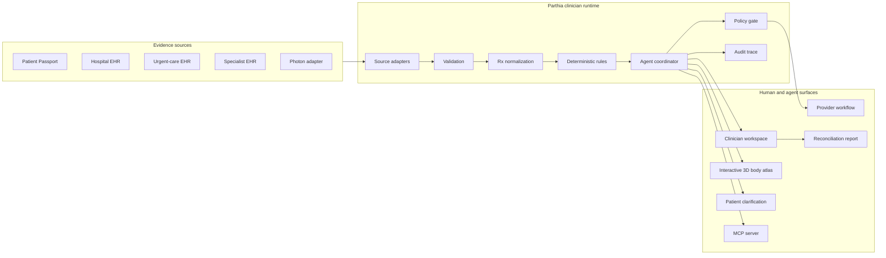

# Parthia Health clinician-agent system design

Parthia reconciles medication evidence that is split across patient-owned records,
clinical systems and pharmacy data. The prototype produces a source-backed review
queue; it does not diagnose, prescribe or change care.

## Design goals

1. Preserve the source and original wording of every medication record.
2. Normalize equivalent brand and generic medications without hiding disagreement.
3. Detect configured interactions and conflicts deterministically.
4. Treat unavailable or incomplete records as an explicit result.
5. Let the agent gather, check and explain while people retain clinical authority.
6. Expose every tool call and decision in an audit trail.

## Context architecture



The browser never declares that an external action succeeded. Adapters return
structured results; the agent records those results and the policy layer decides
whether a requested tool is allowed.

The body atlas is an explanatory visualization built from original WebGL geometry.
It maps a configured medication warning to associated body systems; it is explicitly
labelled as context, not a diagnosis.

## Agent state machine

```text
gather -> validate -> normalize -> reconcile -> check -> clarify -> explain -> route
   |         |            |            |          |          |          |        |
 sources   schema      Rx identity   one view   rules     patient    evidence  reviewer
```

The run can stop at `clarify` for patient input or at `route` for a clinician
decision. Re-running with the recorded input resumes the case rather than duplicating
handoffs.

## Authority boundaries

| Operation | Owner | Agent authority |
| --- | --- | --- |
| Fetch and validate a configured source | Adapter + agent | Allowed |
| Normalize brand/generic names | Deterministic mapping | Allowed |
| Detect configured interaction or conflict | Rule engine | Allowed |
| Explain source-backed evidence | Agent | Allowed |
| Ask patient to confirm an OTC medication | Agent | Allowed |
| Record a clinician review disposition | Clinician | Requires human input |
| Open the Photon provider workflow | Policy gate | Requires approval |
| Start, stop or change a medication | Authorized clinician | Blocked for agent |

## Data and provenance

The event demo uses synthetic, FHIR-shaped fixtures. Prescriber orders map to
`MedicationRequest`; patient-reported use maps to `MedicationStatement`. A
normalized medication contains one or more source records. Those records retain:

- source system and record identifier;
- original display text and status;
- record type and update time;
- normalized ingredient and optional RxCUI;
- availability and confirmation state.

## Detection and explanation

The rule engine owns detection. Each finding has a stable ID, priority, evidence,
review route, question and—when configured—label citation. The conversational agent
can summarize these findings and identify the tools it used. It refuses requests to
change care.

## MCP boundary

The MCP server exposes fourteen tools for inspecting patients, sources,
medications, findings and agent state. Its connector tools can read the public
SMART Health IT FHIR R4 sandbox, resolve terminology through NLM RxNorm, call
Photon Neutron when credentials are configured, and request a grounded OpenRouter
explanation. It is an alternate access surface over the same case and policy
modules; it does not bypass the write gate. Every connector response identifies
itself as live, unavailable, recorded, or deterministic fallback.

## Failure handling

| Failure | Behavior |
| --- | --- |
| Source unavailable | Retry once, record failure, mark the case incomplete |
| Invalid source payload | Stop validation for that source; do not infer missing fields |
| Unmapped medication | Keep the original record and label it unmapped |
| Missing patient confirmation | Pause and ask a bounded yes/no question |
| Photon sandbox unavailable | Show a recorded fallback with an explicit label |
| Agent requests medication change | Policy rejects the tool call and audits the refusal |

## Verification

```bash
npm run lint
npm run typecheck
npm test
npm run mcp:smoke
npm run build
```

The 12-case prototype evaluation includes warnings, safe combinations, incomplete
records and an unavailable source. It checks both expected and prohibited findings.
It is prototype verification, not clinical validation.
